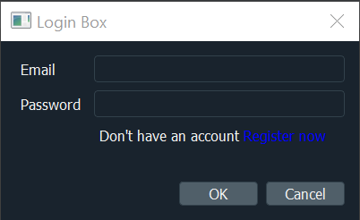
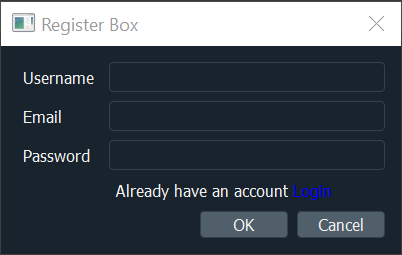
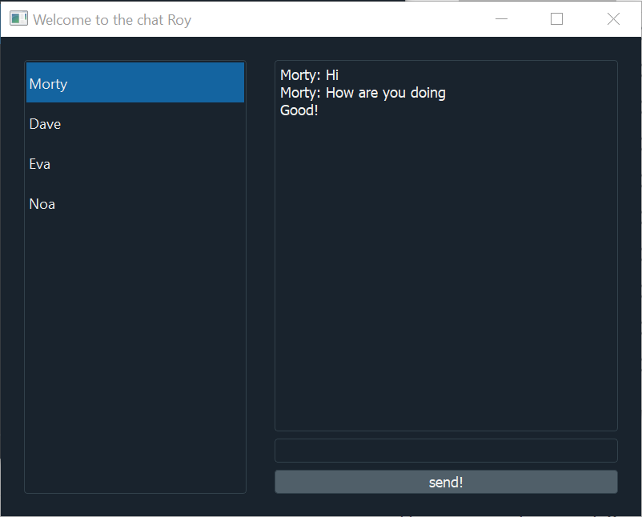

**Firebase chat app**

Chat app used firebase Realtime Database, firebase
Authentication and pyQt5. (the project is still in beta)

**Usage**

For using this project, you need to start new firebase project.
Put your api keys in firebase.py file like this:
```
config = {
            "apiKey": "your data",
            "authDomain": "your data",
            "databaseURL": "your data",
            "projectId": "your data",
            "storageBucket": "your data",
            "messagingSenderId": "your data",
            "appId": "your data"
        }
```
The real time db rules should be (for now):
```
{
  "rules": {
    ".read": "true",
    ".write": "true"
  }
}
```
And you ready run enter_dialog.py

**Screenshots**








